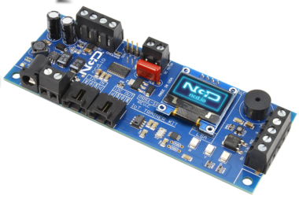

###This text and image should be replaced:
This library provides a class for the MLP115A2 series, it relies on the `ncd-red-comm` library for communication, and includes a node-red node for MLP115A2. The MPL115A2 pressure sensor’s small form factor, low power capability, precision, and
digital output optimize it for barometric measurement applications. [Ncd.io](https://ncd.io) manufactures a [training board](https://store.ncd.io/product/iot-training-controller-light-sound-sensor-action/) that utilizes this chip, along with several others, and is ideal for education applications.

[](https://store.ncd.io/product/iot-training-controller-light-sound-sensor-action/)

### Installation

This library can be installed with npm with the following command:

```
npm install ncd-red-mpl115a2
```

For use in node-red, use the same command, but inside of your node-red directory (usually `~./node-red`).

### Usage

The `test.js` file included in this library contains basic examples for use.  All of the available configurations are available in the node-red node through the UI.

### Raspberry Pi Notes

If you intend to use this on the Raspberry Pi, you must ensure that:
1. I2C is enabled (there are plenty of tutorials on this that differ based on the Pi version.)
2. Node, NPM, and Node-red should be updated to the latest stable versions. If you skip this step the ncd-red-comm dependency may not load properly.
